<!-- hero: ASCII portrait (types in) beside a neofetch-style info panel.
     portrait from pasted art:
       python scripts/make_ascii_svg.py ascii-source.txt
     or from a photo:
       python scripts/prep_photo.py source-photo.jpg && python scripts/make_ascii_svg.py
     info panel: python scripts/make_info_card.py
     all identity/bio content lives in scripts/profile_config.py -->

<h3><code>juan@github ~ $ ./contributions.sh</code></h3>

 
 

<h3><code>juan@github ~ $ whoami</code></h3>

<table>
<tr>
<td valign="top"></td>
<td valign="top"></td>
</tr>
</table>

 

**Software Developer · Backend · .NET**

 

<h3><code>juan@github ~ $ ls ~/achievements</code></h3>

 

